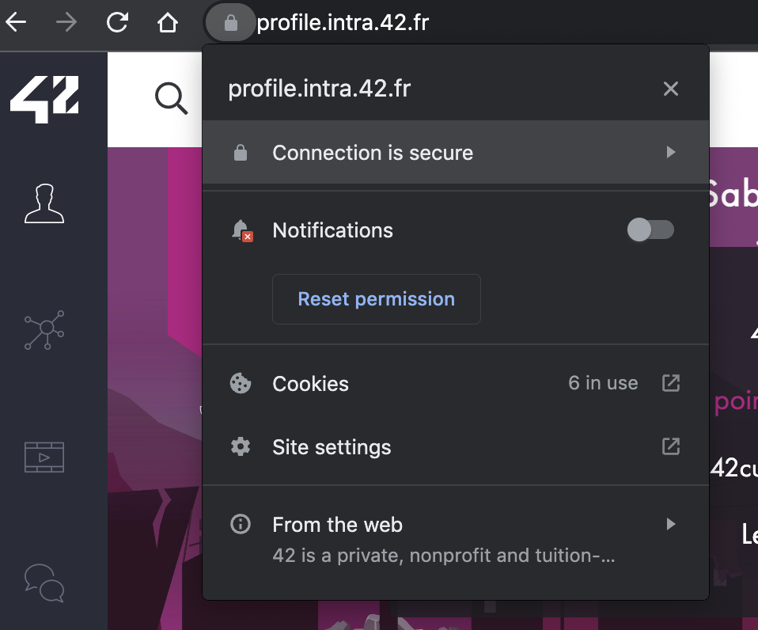
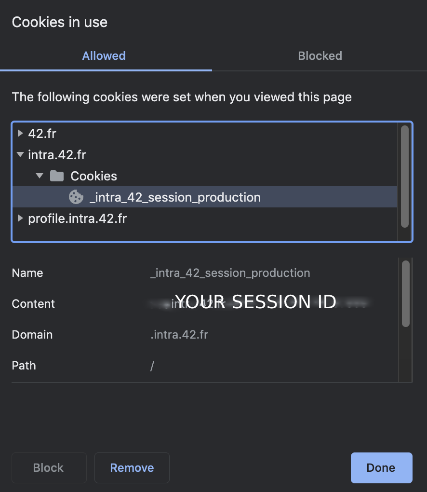

# Slotter
This's a slotter CLI, that will fill/remove the available slots.

## installation

```bash
# using Makefile
make install

# manually install 
python3 -m pip install -r requirements.txt
```

## usage
-First of all, you should create a .env file that will contain the following content:
```
INTRA_SESSION_ID=YOUR INTRA SESSION ID
```
-Follow the steps in the screenshots to get your session id.
*   Step1 -> go to Cookies


*   Step2 -> Copy the `_intra_42_session_production` content



* take slots
  - `python3 cli.py take-slots`
* delete slots
  - `python3 cli.py remove-slots`

## TODO

- Add User-Agent to act like a browser
- Add more options(features) to `take-slots` command

## License
[MIT](./LICENSE.md)