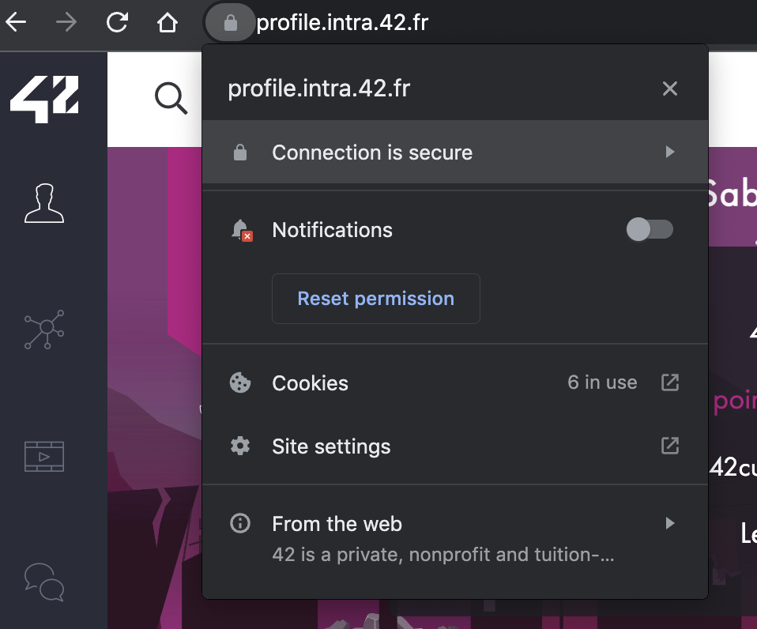
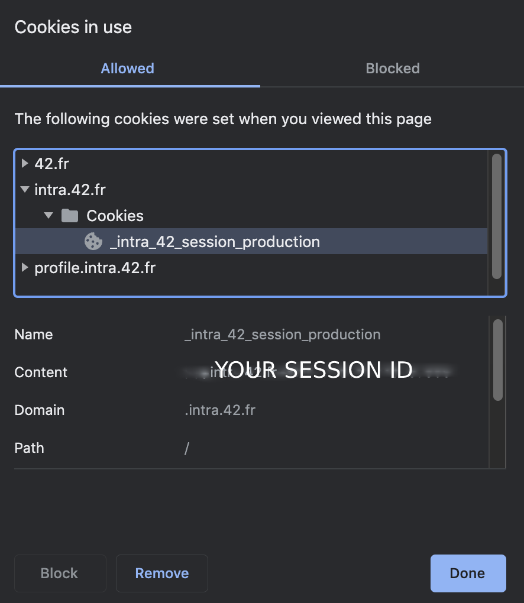

# Slotter
This's a slotter CLI.

## installation

```bash
# using Makefile
make install

# manually install 
python3 -m pip install -r requirements.txt
```

## usage
First off all you should create .env file which will contains the following conetnt:
```
INTRA_SESSION_ID=YOUR INTRA SESSION ID
```
follow the steps in screenshots to get your session id

0 - Step1 -> go to Cookies


1 - Step2 -> Copy the `_intra_42_session_production` content


## TODO

- Add User-Agent to act like a browser
- Add more options(features) to `take-slots` command

## License
MIT